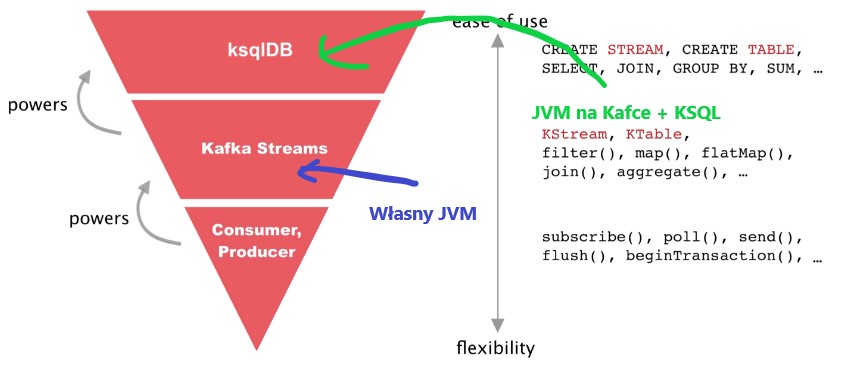

# Kafka
## ksqlDB
ksqlDB stanowi narzędzie, które ma ułatwiać operowanie na streamach kafki za pomocą SQL.\
Pozwala na tworzenie:
- strumieni,
- tabel,
- widoków zmaterializowanych,
- zapytań (pull i push).

Na cały koncept składają się:
- silnik ksqlDB - proceujący SQL ,
- interfejs REST - dający dostęp do ksqlDB,
- ksqlDB CLI - konsola do obsługi ksqlDB, uderza przez REST API,
- ksqlDB UI - UI do obsługi dostarczone przeaz firmę Confluent

Ciekawostka: Silnik ksqlDB został zdefiniowany w pliku https://github.com/confluentinc/ksql/blob/master/ksqldb-engine/src/main/java/io/confluent/ksql/engine/KsqlEngine.java

Dokładny opis działania ksqlDB: https://docs.ksqldb.io/en/latest/operate-and-deploy/how-it-works/ 

